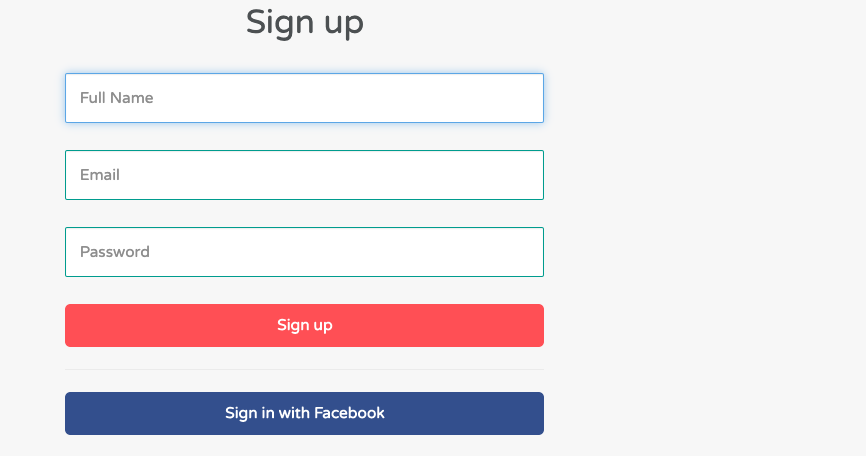
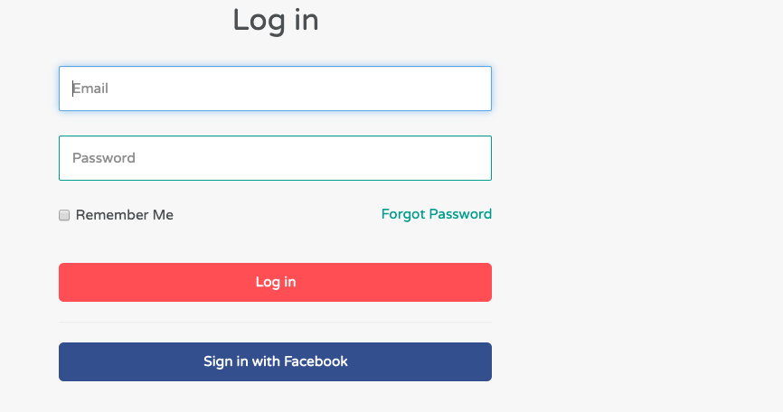
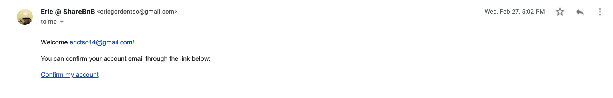
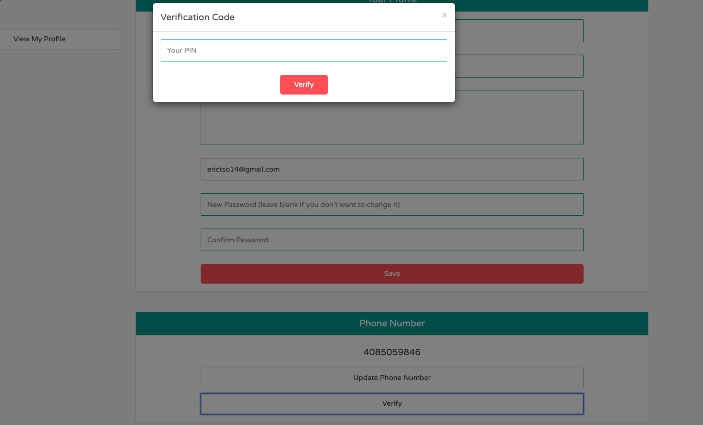
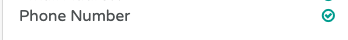
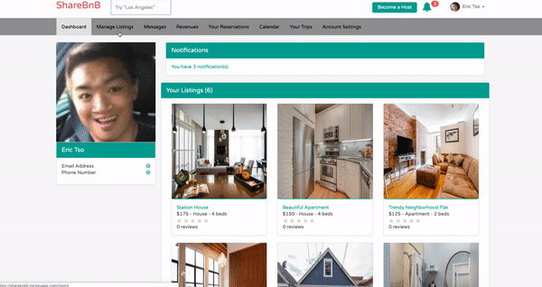
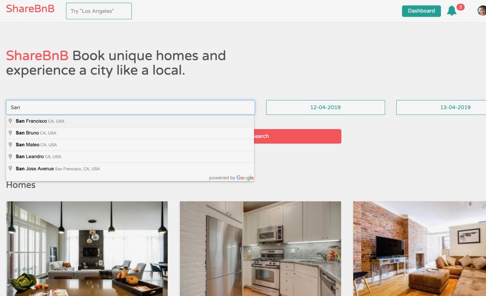
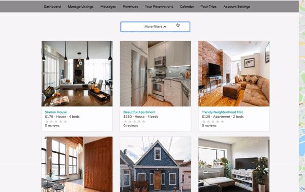
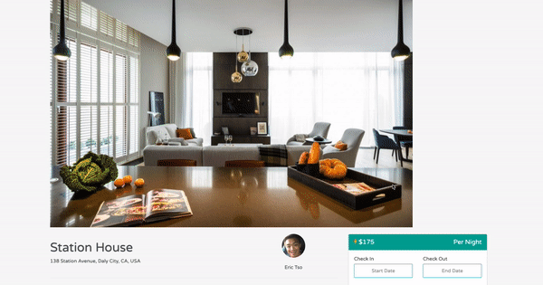

[Link to Live Site](https://sharebnbb.herokuapp.com)
# ShareBnB

  ShareBnB is a fully-spec'ed full-stack web application inspired by AirBnB. I have incorparated many of the features that AirBnB has including payment, payout, sign-up/login with facebook and notifications via email and text message. Users can list their homes for people rent and make money. This read me will include/highlight these cool features, go to the [Live Site](https://sharebnbb.herokuapp.com) make and account and check them out for yourself.

## Technologies Used:
* Ruby on Rails
* Javascript
* PostgreSQL
* Google Maps API
* HTML5 & CSS3
* BootStrap
* Twilio Api
* Facebook Api 
* Stripe Connect Api
* Devise Api
* AWS S3

##  Features
 
### Users(Auth)
  * I went with *Devise* over the usually Bcrypt in this project because Devise's api was much more clean for what I wanted to accomplish. It allowed me to set up email confirmation and allows users to reset their passwords. *Devise* is the choice of many big companies.
  
  <p align="center">
    
    
  </p>
  
&nbsp;&nbsp;
  * Users can make an account with their email, and will get an email confirmation from me. In order for your account to be usable you must verify the email before you can login.
  <p align="center">
    
  </p>
  &nbsp;

  * Facebook Authentication
    - Users can skip the email confirmation step by Signing Up with Facebook. 
    ```
    def facebook
    
      @user = User.from_omniauth(request.env["omniauth.auth"])

      if @user.persisted?
        sign_in_and_redirect @user, :event => :authentication #this will throw if @user is not activated
        set_flash_message(:notice, :success, :kind => "Facebook") if is_navigational_format?
      else
        session["devise.facebook_data"] = request.env["omniauth.auth"]
        redirect_to new_user_registration_url
      end
    end

    ```
* Phone Number Verification 
  - Users can recieve text notifications but first they must verify their phone number. They must go to *Edit Profile* and enter their phone number and click *verify*. They will recieve a text message with a pin code and they must enter it in the verify pin box. Once verified Users with phone numbers verified will recieve a green check icon in their profile. 
  <p align="center">
    
    <br>
    <br>
    
  </p>

### Dashboard
* Once a user has made an account they now have access to a their dashboard. From the dashboard users will have the access to their 
  <p align="center">
    
  </p>

### Searching
  * Customers can search by the city that they want to vacation in. The search can be refined by date or through price, room type, amenities and number of bedrooms/bathrooms.
  <p align="center">
    
    
  </p>
    &nbsp;


### Room Show 
* When customers click on a listing they will be taken to the room show page and this is what they will see. From there they can book/request the room.
  <p align="center">
    
  </p>
  
### Reservations 
* Reservations can be made on the room show page. Instant bookings will be booked right away and requested bookings needs to be approved by the host.


### Notifications
* When a reservation is booked guest will recieve a a notification via email, text message, or both. Users can configure their notification settings in *Account Settings*.

## Becoming a host
* User's with that wish to list their rooms on the site must connect their stripe account to the ShareBnB account. That way they can cashout their earnings.
## Renting a room
* Guest must add a credit card in order to book a room.
### Messaging
* Host can message guest and guest can message host. ShareBnB feature of live messaging uses *WebSocket*s. Like HTTP, WebSocket is a communication protocol that uses what is known as _full-duplex_ communicatiom

 Whereas in HTTP request/response cycles, one machine must act as a sender and another as a receiver in disparate cycles, WebSockets allows for persistent connections between clients and servers, and allows for both entities to transmit and receive information simultaneously.

```Javascript
$(() ->
  App.messages = App.cable.subscriptions.create {channel: 'MessagesChannel', id: $('#conversation_id').val() },
    received: (data) ->
      $('#new_message')[0].reset()
      $('#chat').prepend data.message
)

```
### Calendar
  * The host Calendar is my the feature that I am most proud of. It is a very convient tool for host to manage their listings. Each listing has its own calendar and Host can easily change the prices and availibility of their listings. 
### Payment
### Payout
### Revenue

### 

### 
### 
### 
### 
###
### 
### 