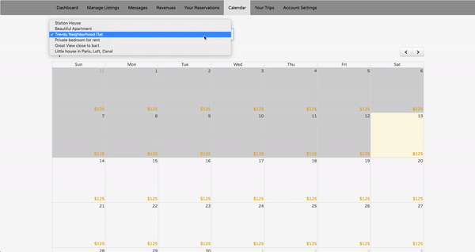
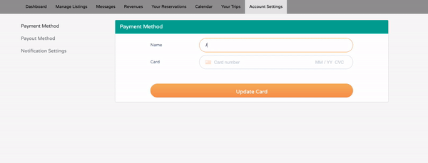
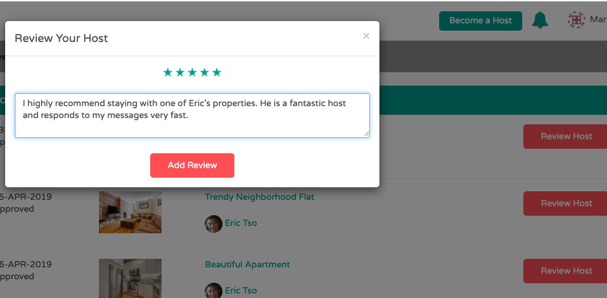
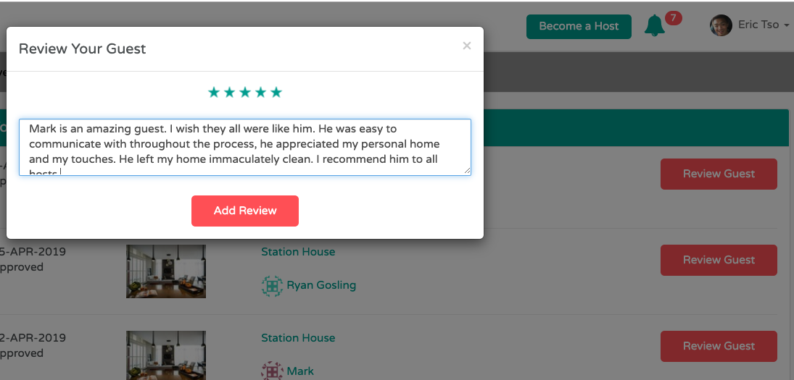

[Link to Live Site](https://sharebnbb.herokuapp.com)
# ShareBnB

  ShareBnB is a fully-spec'ed full-stack web application inspired by AirBnB. I have incorparated many of the features that AirBnB has including payment, payout, sign-up/login with facebook and notifications via email and text message. Users can list their homes for people rent and make money. This read me will include/highlight these cool features, go to the [Live Site](https://sharebnbb.herokuapp.com) make and account and check them out for yourself.
# Table of Contents
1. [Technologies Used](#Technologies-Used)
2. [Features](#Features)
    - [Users(Auth)](#Users(Auth))
    - [Dashboard](#Dashboard)
    - [Searching](#searching)
    - [Room Show](#Room-show)
    - [Reservations](#Reservations)
    - [Notifications](#Notifications)
    - [Becoming a host](#Becoming-a-host)
    - [Renting a Room](#Renting-a-Room)
    - [Messaging](#Messaging)
    - [Calendar](#Calendar)
    - [Payment](#Payment)
    - [Payout](#Payout)
    - [Revenue](#Revenue)
    - [Reviews](#Reviews)
    - []()

## Technologies Used:
* Ruby on Rails
* Javascript
* PostgreSQL
* Google Maps API
* HTML5 & CSS3
* BootStrap
* Twilio Api
* Facebook Api 
* Stripe Connect Api
* Devise Api
* AWS S3


##  Features
 
### Users(Auth)
  * I went with *Devise* over the usually Bcrypt in this project because Devise's api was much more clean for what I wanted to accomplish. It allowed me to set up email confirmation and allows users to reset their passwords. *Devise* is the choice of many big companies.
  
  <p align="center">
    
    
  </p>
  
&nbsp;&nbsp;
  * Users can make an account with their email, and will get an email confirmation from me. In order for your account to be usable you must verify the email before you can login.
  <p align="center">
    
  </p>
  &nbsp;

  * Facebook Authentication
    - Users can skip the email confirmation step by Signing Up with Facebook. 
    ```
    def facebook
    
      @user = User.from_omniauth(request.env["omniauth.auth"])

      if @user.persisted?
        sign_in_and_redirect @user, :event => :authentication #this will throw if @user is not activated
        set_flash_message(:notice, :success, :kind => "Facebook") if is_navigational_format?
      else
        session["devise.facebook_data"] = request.env["omniauth.auth"]
        redirect_to new_user_registration_url
      end
    end

    ```
    &nbsp;
* Phone Number Verification 
  - Users can recieve text notifications but first they must verify their phone number. They must go to *Edit Profile* and enter their phone number and click *verify*. They will recieve a text message with a pin code and they must enter it in the verify pin box. Once verified Users with phone numbers verified will recieve a green check icon in their profile. 
  <p align="center">
    
    <br>
    <br>
    
  </p>
&nbsp;
### Dashboard
* Once a user has made an account they now have access to a their dashboard. From the dashboard users will have the access to their 
  <p align="center">
    
  </p>

### Searching
  * Customers can search by the city that they want to vacation in. The search can be refined by date or through price, room type, amenities and number of bedrooms/bathrooms.
  <p align="center">
    
    
  </p>
    &nbsp;


### Room Show 
* When customers click on a listing they will be taken to the room show page and this is what they will see. From there they can book/request the room.
  <p align="center">
    
  </p>
  
### Reservations 
* Reservations can be made on the room show page. Instant bookings will be booked right away and requested bookings needs to be approved by the host.


### Notifications
* When a reservation is booked guest will recieve a a notification via email, text message, or both. Users can configure their notification settings in *Account Settings*.

## Becoming a host
* User's with that wish to list their rooms on the site must connect their stripe account to the ShareBnB account. That way they can cashout their earnings.
## Renting a room
* Guest must add a credit card in order to book a room.
### Messaging
* Host can message guest and guest can message host. ShareBnB feature of live messaging uses *WebSocket*s. Like HTTP, WebSocket is a communication protocol that uses what is known as _full-duplex_ communicatiom

 Whereas in HTTP request/response cycles, one machine must act as a sender and another as a receiver in disparate cycles, WebSockets allows for persistent connections between clients and servers, and allows for both entities to transmit and receive information simultaneously.

```Javascript
$(() ->
  App.messages = App.cable.subscriptions.create {channel: 'MessagesChannel', id: $('#conversation_id').val() },
    received: (data) ->
      $('#new_message')[0].reset()
      $('#chat').prepend data.message
)

```
- Coding it this way allows the messaging to be instant. Meaning as soon as I hit send the other user receives the message instantly. The *Notifications* are also real time.

```
$(() ->
  App.notifications = App.cable.subscriptions.create {channel: "NotificationsChannel", id: $('#user_id').val() },
    received: (data) ->
      $('#num_of_unread').html(data.unread)
      $('#notifications').prepend(data.message)
      $('#navbar_num_of_unread').html(data.unread)
)

```
### Calendar
  * The host Calendar is my the feature that I am most proud of. Using the gem *fullCalendar-rails*, It is a very convient tool for host to manage their listings. Each listing has its own calendar and Host can easily change the prices and availibility of their listings. These changes that users make on their calendar will be accounted for when a guest checks out a room. Days with special prices will be listed. Take a look at the schema.
  ```
   create_table "calendars", force: :cascade do |t|
    t.date "day"
    t.integer "price"
    t.integer "status"
    t.bigint "room_id"
    t.datetime "created_at", null: false
    t.datetime "updated_at", null: false
    t.index ["room_id"], name: "index_calendars_on_room_id"
  end
  ```
  <p align="center">
    
  </p>
  <br>
  <br>

### Payment
* Checkout is done in the *Room Show* page and users select the dates that they want to book the room and when they hit the Book Now button their card will be charged. If the room is not an instant booking room then they will only be charged when the host approves their stay. If a reservation has been book/request both the host and the guest will receive notifications of the transaction. The Reservation#charge method does all the work
```
  def charge(room, reservation)
      if !reservation.user.stripe_id.blank?
        customer = Stripe::Customer.retrieve(reservation.user.stripe_id)
        charge = Stripe::Charge.create(
          :customer => customer.id,
          :amount => reservation.total * 100,
          :description => room.listing_name,
          :currency => "usd"
          :destination => {
            :amount => reservation.total * 80, # 80% of the total amount goes to the Host
            :account => room.user.merchant_id # Host's Stripe customer ID
          }
        )
  
        if charge
          reservation.Approved!
           ReservationMailer.send_email_to_guest(reservation.user, room).deliver_later if reservation.user.setting.enable_email
        unless current_user.phone_verified.blank?
           send_sms(room, reservation) if room.user.setting.enable_sms
        end
          flash[:notice] = "Reservation created successfully!"
        else
          reservation.Declined!
          flash[:alert] = "Cannot charge with this payment method!"
        end
      end
    rescue Stripe::CardError => e
      reservation.declined!
      flash[:alert] = e.message
    end
```

* By integrating stripe Users of ShareBnB are able to Add their credit card and checkout. Guest will not be able to checkout unless they have a credit card saved on their account. If a guest tries to checkout without a credit card saved they will be redirected to the Payment Method page. Payment Methods can be accessed in the *Account Settings* tab.

  <p align="center">
    
  </p>
  <br>
  <br>

### Payout
* Host can withdraw all their earnings whenever they please. Thanks to Stripe Express. The host get 80% of the total earnings and I recieve 20%.
```
  customer = Stripe::Customer.retrieve(reservation.user.stripe_id)
        charge = Stripe::Charge.create(
          :customer => customer.id,
          :amount => reservation.total * 100,
          :description => room.listing_name,
          :currency => "usd"
          :destination => {
            :amount => reservation.total * 80, # 80% of the total amount goes to the Host
            :account => room.user.merchant_id # Host's Stripe customer ID
          }
        )
```

### Revenue
  * I have integrated weekly revenue charts with *Chartkick* this feature allows host to easily visualize their weekly earnings.

### Reviews
* Host can review guest and guest can review host. This two way review system makes for better customer experiece. Host can deny guest with bad reviews from staying at their house. If a host has bad reviews then Guest can know this and choose not to stay with the host.

  <p align="center">
    
    

  </p>
  
  <br>
  <br>

### 
### 
### 
### 
###
### 
### 